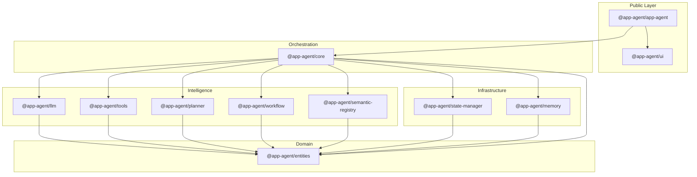
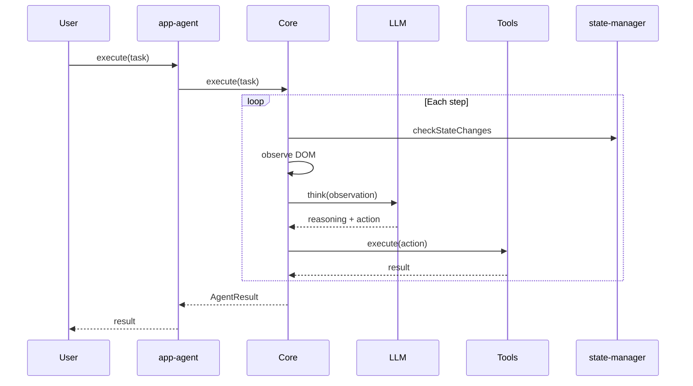

# App-Agent Architecture

Canonical architecture documentation for the app-agent monorepo.

> Research and vision documents are archived in `rnd/`. This file reflects the implemented package structure.

## Vision

App-Agent is an **application-centric** AI agent framework. Unlike page-centric (page-agent) or browser-centric (browser-use) tools, app-agent understands entire application context via injected `getAppState()`.

## Package Layers



## 5-Senses Model

| Sense      | Package                          | Capability                          |
| ---------- | -------------------------------- | ----------------------------------- |
| Visual     | `core/dom`                       | DOM perception and interaction      |
| App State  | `state-manager`                  | State injection and change tracking |
| Navigation | `workflow`                       | Multi-step journey orchestration    |
| Semantic   | `semantic-registry` + `entities` | Domain entity understanding         |
| Behavioral | `memory` + `planner`             | Pattern memory and task planning    |

## Data Flow (ReAct Loop)



## Key Decisions

See [ADR index](./adr/README.md):

- ADR-0001: Modular monolith structure
- ADR-0002: entities vs semantic-registry split
- ADR-0003: Unified tool system
- ADR-0004: Public facade package
- ADR-0005: Storage port pattern

## Technology Stack

- TypeScript (strict), ES2022, DOM libs
- pnpm workspace monorepo
- Zod validation, EventEmitter3 events
- OpenAI-compatible LLM APIs
- Client-side only — no backend required
- Vitest for testing, dependency-cruiser for architecture

## Consumer API

```typescript
import { AppAgent } from '@app-agent/app-agent';

const agent = new AppAgent({
  baseURL: 'https://api.openai.com/v1',
  model: 'gpt-4',
  getAppState: async () => ({/* ... */}),
  entities: { Product: productSchema },
  workflows: { checkout: checkoutWorkflow },
});

await agent.execute('Add laptop to cart');
```
