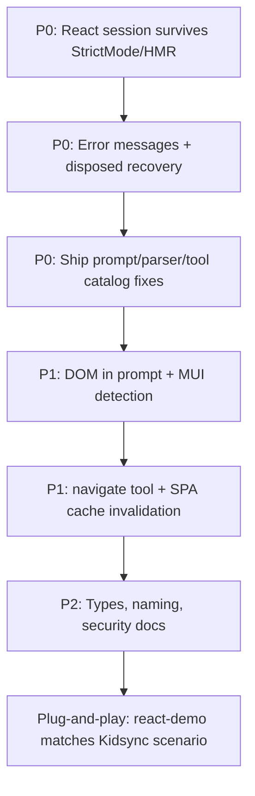

# Field report: Kidsync React pilot — plug-and-play gaps

**Audience:** App-Agent maintainers and coding agents fixing the framework  
**Consumer:** [Kidsync](https://github.com/labKnowledge/app-agent-framework) (childcare SaaS, React 18 + Vite + MUI + React Router)  
**Pilot URL:** `https://kids.eligapris.tech` (dev)  
**Packages tested:** `@gakwaya/app-agent@0.1.3`, `@gakwaya/integrations-react@0.1.3`  
**Evidence:** `kidsync/rnd/kids.eligapris.tech-app-agent-struggling.har`, console logs, UI screenshots (`Status: disposed`)

---

## Executive summary

**Update (main @1.0.x):** Framework now ships `AppAgentSessionProvider`, `AppAgentShell`, intent routing, and cross-session `ConversationStore`. See [ADR-0010](../adr/ADR-0010-agent-session-decoupling.md). Kidsync should upgrade from 0.1.3 and remove `kidsyncAgentSession.ts`.

Kidsync integrated App-Agent as an in-app “AI assistant (pilot)” — floating dialog + sample prompts over a real authenticated SPA (dashboard, attendance, children). **Plug-and-play gaps from 0.1.3 are addressed on main; verify after npm release.**

Two failure modes appeared in production-like dev on **0.1.3**:

| Phase | Symptom | Root layer |
|-------|---------|------------|
| **A — Lifecycle** | `Task aborted by user`, **0 steps**, UI shows **`Status: disposed`**, no LLM HTTP calls | React integration + core dispose/abort semantics |
| **B — Execution** | 12× LLM 200 OK but task never completes; invented tools (`click_element`, `navigate_to_url`) | Core prompt/parser/tools + DOM pipeline (partially fixed on main, not in 0.1.3 npm) |

Phase A blocked all usage until Kidsync added a **module-level session singleton** workaround. Phase B blocked task completion even when the agent ran.

**Goal for framework:** A consumer should mount `AppAgentProvider`, call `useAppAgent().execute()`, and get working behavior in a default Vite + StrictMode app **without** custom session code, dialog placement docs, or prompt debugging.

---

## Framework status (main @1.0.x)

| Criterion | Status on main |
|-----------|----------------|
| Mount once at app shell | `AppAgentSessionProvider` + `AppAgentShell` portal |
| StrictMode dev | Ref-count session + tests in `integrations/react` |
| First task | Unchanged |
| Navigation tasks | `onNavigate` + `navigate` builtin |
| DOM tasks | Fixed BUG-0003/0004 on main |
| Errors | Disposed vs user abort distinguished |
| Types | `AppAgentSessionProviderProps` exported |
| Security doc | See publishing.md backend proxy + `RemoteStorageAdapter` |

### Application-first execution (Kidsync attendance)

Prefer `customTools` over DOM for data operations:

```typescript
customTools: {
  markAttendance: {
    name: 'markAttendance',
    description: 'Mark attendance for all enrolled children for today',
    inputSchema: z.object({ date: z.string().optional() }),
    execute: async (_params, ctx) => {
      await api.markAllAttendance(ctx.appState);
      return 'Marked attendance for all children';
    },
  },
},
onNavigate: (path) => navigate(path),
workflows: {
  attendance: {
    name: 'attendance',
    description: 'Open attendance view',
    steps: [{ id: 'nav', name: 'Go to attendance', toolName: 'navigate', parameters: { path: '/attendance' } }],
  },
},
preferApplicationTools: true,
```

Intent router matches workflow/tool names before entering the 58-step ReAct loop.

---

## Expected plug-and-play contract (original)

Use this as acceptance criteria for “React integration works”:

1. **Mount once** at app shell (or documented pattern); opening/closing UI must not require custom singletons.
2. **StrictMode dev:** After remount, `execute()` works; `status` is never stuck on `disposed` while UI is visible.
3. **First task:** Reaches LLM (network `chat/completions`) unless API key missing.
4. **Navigation tasks:** Built-in `navigate` tool works for SPA routes (or documented router hook).
5. **DOM tasks:** MUI buttons/links appear in prompt with indices; model uses `{ "click": { "index": N } }`.
6. **Errors:** Distinguish `Agent has been disposed`, `Task cancelled`, LLM failure, unknown tool — never label dispose as “aborted by user”.
7. **Types:** `AppAgentProvider` props (`mountPanel`, etc.) match runtime and published `.d.ts`.
8. **Security doc:** Browser-side API keys are dev-only; recommend backend proxy for production.

---

## Integration architecture (Kidsync)

```
main.tsx (React.StrictMode)
  └─ App.tsx / BrowserRouter
       └─ KidsyncAppAgentShell          ← must wrap app, NOT inside Dialog
            └─ KidsyncAppAgentProvider   ← custom; avoids AppAgentProvider dispose trap
                 └─ … entire app …
                      └─ AppAgentLauncher (Dialog)
                           └─ AppAgentConsole → useKidsyncAppAgent().execute()
```

**Config** (`useKidsyncAgentConfig.ts`):

- `getAppState` via ref (route, user, org, children slice) — required because provider freezes config at mount
- `entities`: Child, Organization
- `workflows`: check-in → `/check_in`
- `trackState`, `enableMemory`, `maxSteps: 12`
- LLM: DashScope OpenAI-compatible (`qwen-plus`) via `VITE_APP_AGENT_*` env vars

**Required workaround (still needed on 0.1.3):** `kidsyncAgentSession.ts` — `acquireKidsyncAgentContext()` / `releaseKidsyncAgentSession()` so StrictMode + HMR do not leave a disposed agent in context.

---

## Challenge catalog

### 1. React lifecycle — `Status: disposed` (BLOCKER)

**Bug ID:** [BUG-0001](../bugs/BUG-0001-react-strictmode-disposed-agent.md)  
**Status on npm 0.1.3:** Partially addressed; **still broken for plug-and-play**

#### Symptoms

- UI chip: **`Status: disposed`**
- Console: `[AppAgent] Task execution failed: { error: Task aborted by user, steps: 0 }`
- Network: **no** `chat/completions` request
- User did not cancel

#### Cause chain

1. `AppAgentProvider` registers `useEffect(() => () => context.dispose(), [context])`.
2. React 18 **StrictMode** (default in Vite) simulates unmount → `dispose()` → `abortController.abort()` + `status = 'disposed'`.
3. 0.1.3 switched `useMemo([])` → `useState` lazy init (good) and resets `AbortController` per `runTask` (good).
4. **Still fails** because after StrictMode dispose, React context can expose a **dead agent** whose `getState()` still reports `disposed` until full remount — and dev **Vite HMR** repeats dispose on every file save.

#### What we tried

| Approach | Result |
|----------|--------|
| Provider inside MUI `Dialog` only | Dispose on every dialog close |
| Provider at app shell with `AppAgentProvider` 0.1.3 | Still `disposed` in StrictMode/HMR dev |
| Module singleton `acquireKidsyncAgentContext` | **Works** — only reliable fix |

#### Recommended framework fixes

| Priority | Change | Package |
|----------|--------|---------|
| P0 | Do **not** call `agent.dispose()` on StrictMode simulated unmount; use ref-count or `sessionId` guard | `integrations-react` |
| P0 | If `agent.status === 'disposed'`, auto-recreate context inside provider before rendering children | `integrations-react` |
| P0 | Export `AppAgentSessionProvider` pattern officially (singleton optional, remount-safe required) | `integrations-react` |
| P1 | Surface `status: disposed` in docs as fatal; hook should throw or auto-recover | `integrations-react` |
| P1 | Distinct errors: disposed vs user cancel | `core` |

#### Agent implementation checklist

- [ ] Add test: `<StrictMode><AppAgentProvider>…</StrictMode>`, click execute, assert status ≠ `disposed` and steps > 0 (mock LLM)
- [ ] Add test: HMR simulation (unmount/remount provider) then execute succeeds
- [ ] Document: provider **must** live above modal/dialog routes (with diagram)

---

### 2. Misleading error — “Task aborted by user” (HIGH)

**Bug ID:** BUG-0001 (related)

When `abortController.signal.aborted` is true at step 0, core throws `Task aborted by user` even for programmatic `dispose()`. 0.1.3 adds `_disposed` check but consumers still see the wrong message in edge cases.

**Fix:** Never use “aborted by user” unless `abortTask()` was called explicitly. Use `Agent has been disposed` or `Task superseded by new execute()`.

---

### 3. Prompt / action format mismatch (BLOCKER for tasks)

**Bug ID:** [BUG-0002](../bugs/BUG-0002-prompt-action-format-mismatch.md)  
**Status:** Fixed on framework main; **not verified in published 0.1.3**

#### HAR evidence

LLM (qwen-plus) returned:

```json
"action": {
  "action_name": "click_element",
  "parameters": { "element_description": "Attendance tab" }
}
```

Runtime `act()` does:

```typescript
const actionName = Object.keys(reasoning.action)[0]; // → "action_name"
```

Result: `Unknown action: action_name` every step.

#### Root cause

System prompt (0.1.3) said:

```text
- action: { action_name: parameters }
```

Model followed literally. Parser expects:

```json
{ "click": { "index": 0 } }
```

#### Fix on main (verify shipped)

- `prompt-builder.ts`: explicit examples, forbid `action_name`
- Inject **tool catalog** into user prompt (`buildToolsSection`)
- `parse-reasoning.ts`: normalize legacy shapes

#### Agent checklist

- [ ] Publish patch including prompt + parser fixes
- [ ] Golden test: sample LLM JSON with `action_name` normalizes to `click`
- [ ] Golden test: system prompt never contains substring `action_name`

---

### 4. DOM content omitted from prompt (HIGH)

**Bug ID:** [BUG-0003](../bugs/BUG-0003-dom-content-not-in-prompt.md)

`observe()` built `domState.content` (indexed elements) but user prompt only included URL + title. Model guessed element names instead of indices.

**Fix:** Include `domState.content`, footer, empty-DOM guidance in `buildUserPrompt`.

---

### 5. MUI / SPA — zero interactive elements (HIGH)

**Bug ID:** [BUG-0004](../bugs/BUG-0004-mui-interactive-detection.md)

Kidsync dashboard (MUI): HAR showed `interactiveElements.size === 0`, empty `content`, while footer claimed “Interactive elements: 20” inconsistently.

MUI uses `role="button"` divs, tabs, menu items — detection was incomplete.

**Fix:** Allowlist interactive ARIA roles; index MUI controls.

**Kidsync note:** Even with detection fixes, shadow portals / dynamic lazy routes may need `wait` + re-observe.

---

### 6. No navigate tool (MEDIUM)

**Bug ID:** [BUG-0005](../bugs/BUG-0005-no-navigate-tool.md)

Model invented `navigate_to_url`, `navigate_to`. Builtins were click/input/scroll/wait/done only.

Tasks like “go to attendance” require navigation. Kidsync uses React Router client-side routes (`/attendance`, `/check_in`).

**Fix:** Add `navigate({ path })` builtin using `window.location.assign` or configurable navigator callback.

**Plug-and-play gap:** For SPA routers, document `customTools.navigate` or `history.push` integration — `location.assign` causes full reload on some apps.

---

### 7. DOM cache stale after SPA navigation (MEDIUM)

**Bug ID:** [BUG-0006](../bugs/BUG-0006-dom-cache-stale-after-spa-nav.md)

Cache keyed on weak checksum + 5s TTL; React Router pathname changes could serve empty tree from prior route.

**Fix:** Invalidate on `location.href` change; clear cache after mutating actions.

---

### 8. TypeScript / DX friction (LOW)

- `AppAgentProviderProps` extends `CreateAgentContextOptions` but published `.d.ts` omits `mountPanel` — Kidsync uses `{...({ mountPanel: false } as Record<string, unknown>)}`.
- Package naming drift: docs mention `@gakwaya/app-agent-react`; npm still `@gakwaya/integrations-react`.

---

### 9. Security / ops (DOCUMENTATION)

Kidsync pilot calls DashScope **from the browser** (`origin: https://kids.eligapris.tech`). API key in `VITE_APP_AGENT_LLM_API_KEY` is exposed to clients.

**Plug-and-play for production:** Document backend proxy pattern; optional `AppAgent` server-side runner.

---

## HAR timeline ( condensed )

| Time (UTC) | Event |
|------------|--------|
| 21:57–22:10 | Page loads, agent modules, **zero** LLM calls — Phase A (disposed / abort) |
| 22:11:58+ | Task “mark all kids attendance for today” — **12×** `chat/completions` 200 — Phase B |
| LLM steps | Model repeatedly used invalid action shapes; loop exhausted `maxSteps` |

Full HAR path in Kidsync repo: `rnd/kids.eligapris.tech-app-agent-struggling.har`

---

## Consumer workaround reference (Kidsync)

Until framework is truly plug-and-play, Kidsync uses:

| File | Purpose |
|------|---------|
| `frontend/src/agent/kidsyncAgentSession.ts` | Module singleton; survives StrictMode/HMR |
| `frontend/src/components/agent/KidsyncAppAgentShell.tsx` | Provider above app shell, not in Dialog |
| `frontend/src/agent/useKidsyncAgentConfig.ts` | `configRef` for live `getAppState` |
| `frontend/src/components/agent/AppAgentConsole.tsx` | Guards `status === 'disposed'` in UI |

**Do not remove** session singleton until `integrations-react` passes StrictMode + HMR tests without it.

---

## Suggested fix order (for agents)



1. **integrations-react** — remount-safe provider (no dead `disposed` in context)
2. **core** — error taxonomy + per-task abort
3. **core + llm** — prompt/tool catalog/normalization (BUG-0002)
4. **core dom** — BUG-0003, BUG-0004, BUG-0006
5. **tools** — BUG-0005 + optional router hook
6. **examples/react-demo** — replicate: StrictMode, MUI, Dialog launcher, React Router, mock LLM

---

## Test matrix to add

| Scenario | Assert |
|----------|--------|
| StrictMode + execute | status not `disposed`; steps ≥ 1 |
| Provider in Dialog open/close/open | execute works without singleton |
| MUI dashboard mock | `domState.content` lists ≥ 1 index |
| Prompt contains tool names | `click`, `navigate`, `done`, … |
| LLM returns `{ action_name: … }` | normalized or clear error |
| React Router `/a` → `/b` | DOM cache rebuilds |
| Missing API key | friendly config error, not disposed |

---

## Related bug tickets

| ID | Title |
|----|-------|
| [BUG-0001](../bugs/BUG-0001-react-strictmode-disposed-agent.md) | StrictMode dispose → 0 steps |
| [BUG-0002](../bugs/BUG-0002-prompt-action-format-mismatch.md) | `action_name` prompt mismatch |
| [BUG-0003](../bugs/BUG-0003-dom-content-not-in-prompt.md) | DOM list not in prompt |
| [BUG-0004](../bugs/BUG-0004-mui-interactive-detection.md) | MUI elements not indexed |
| [BUG-0005](../bugs/BUG-0005-no-navigate-tool.md) | Missing navigate tool |
| [BUG-0006](../bugs/BUG-0006-dom-cache-stale-after-spa-nav.md) | Stale DOM cache on SPA nav |

---

## Contact / reproduction

1. Clone Kidsync, set `VITE_APP_AGENT_LLM_*`, `yarn dev`
2. Login, open AI assistant dialog, click sample prompt
3. Observe `Status: disposed` without session workaround
4. Compare with HAR capture in `rnd/`

**Maintainers:** Treat this document as the single integration narrative tying BUG-0001–0006 to plug-and-play acceptance criteria. Update status columns when npm releases close each gap.
